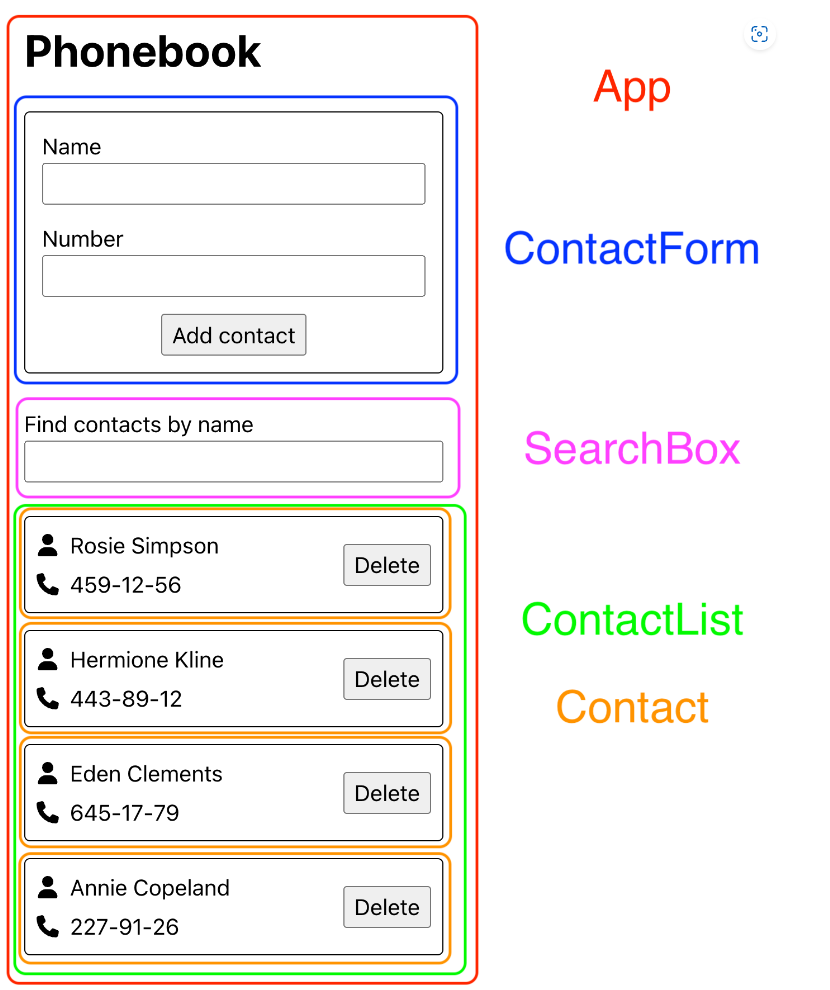
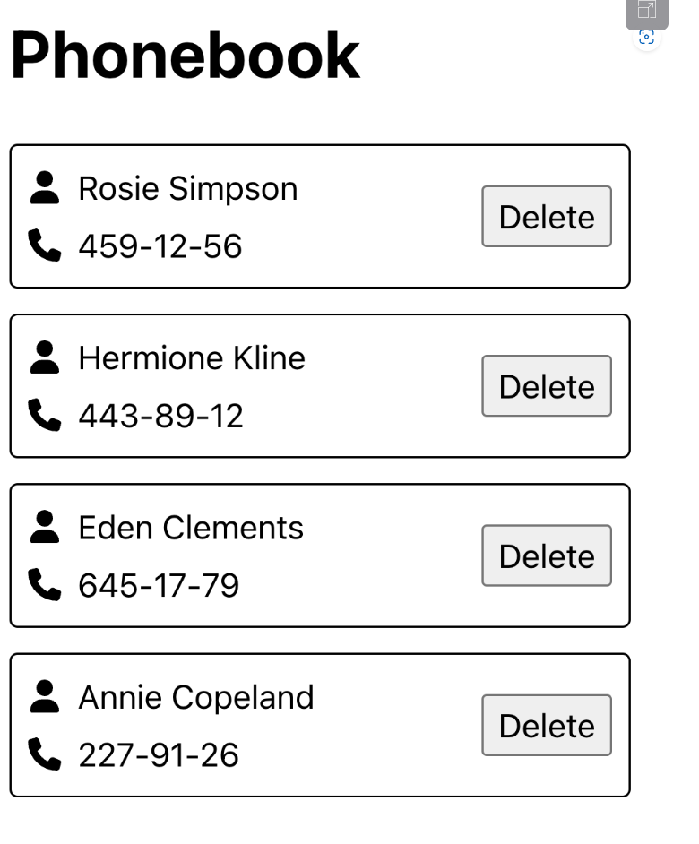
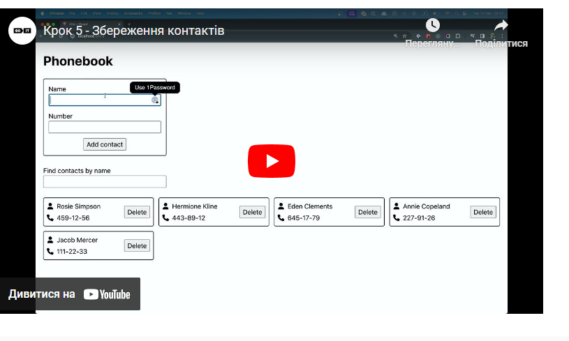

Домашнє завдання

Створи репозиторій з назвою goit-react-hw-06
При здачі домашньої роботи надай два посилання: одне на вихідні файли та інше на робочу сторінку завдання на Vercel.
Проект повинен бути створений за допомогою Vite.
Під час запуску коду завдання в консолі не повинно бути помилок або попереджень.
Для кожного компонента у папці src/components є окрема папка, яка містить JSX файл самого React компонента та файл його стилів. Назва папки, файла компонента (з розширенням .jsx) та файла стилів (перед .module.css) однакова і відповідає назвам, вказаним у завданнях (якщо вони були).
Для експорту компонентів використовується експорт за замовчуванням (export default).
JS-код має бути чистим і зрозумілим, використовуйте Prettier.
Використана бібліотека Redux Toolkit
Стилізація повинна бути виконана за допомогою CSS-модулів.

Книга контактів

Виконай рефакторинг коду твого застосунку «Книга контактів» із домашнього завдання третього модуля. Додай управління станом за допомогою бібліотеки Redux Toolkit, замість локального React стану.

Папки та файли

Створи папку src/redux для зберігання файлів, пов'язаних із логікою Redux:

store.js - файл створення стору
contactsSlice.js - файл слайсу для контактів
filtersSlice.js - файл слайсу для фільтрів

Початковий стан

Нехай початковий стан Redux виглядає наступним чином.

{
contacts: {
items: []
},
filters: {
name: ""
}
}

Тут ми виділимо два слайси - контакти (поле contacts) і фільтри (поле filters).

Слайс контактів

У файлі contactsSlice.js оголоси слайс контактів, використовуючи функцію createSlice().

Екшени слайса для використання в dispatch:

addContact - додавання нового контакту до властивості items
deleteContact - видалення контакту за id з властивості items

Оголоси функції-селектори для використання в useSelector:

selectContacts - повертає список контактів з властивості items.

З файла слайса експортуй редюсер, а також його екшени і селектори.

Слайс фільтра

У файлі filtersSlice.js оголоси слайс фільтра, використовуючи функцію createSlice().

Екшени слайса для використання в dispatch:

changeFilter - зміна значення фільтра в властивості name

Оголоси функції-селектори для використання в useSelector:

selectNameFilter - повертає значення фільтра з властивості name.

З файла слайса експортуй редюсер, а також його екшени і селектори.

Бібліотека React Redux

Зв'яжи React-компоненти з Redux-логікою за допомогою хуків useSelector та useDispatch бібліотеки React Redux.

Усі компоненти, крім карточки контакту Contact у списку контактів ContactList, не повинні приймати жодних пропсів. Замість цього, компоненти мають використовувати хук useSelector та функції-селектори слайсів для отримання необхідних їм значень.

Для відправки екшенів компоненти використовують хук useDispatch та оголошені раніше екшени слайсів:

Форма ContactsForm відправляє екшен додавання контакту при сабміті
Карточка контакту Contact відправляє екшен видалення контакту при кліку по кнопці видалення
Поле фільтра SearchBox відправляє екшен зміни фільтра при введенні в текстове поле

Бібліотека Redux Persist

Використай бібліотеку Redux Persist для збереження масиву контактів у локальному сховищі.

У файлі store.js:

Створи конфігурацію для збереження поля items зі слайса контактів.
Використовуй persistReducer, щоб застосувати конфігурацію до редюсера слайса контактів.
Використовуй persistStore для створення persistor для PersistGate.

Створіть репозиторій з назвою goit-react-hw-03.
При здачі домашньої роботи надайте два посилання: одне на вихідні файли та інше на робочу сторінку завдання на Vercel.
Проект повинен бути створений за допомогою Vite.
Для створення форм використовуйте бібліотеку Formik.
Під час запуску коду завдання в консолі не повинно бути помилок або попереджень.
Для кожного компонента у папці src/components є окрема папка, яка містить JSX файл самого React компонента та файл його стилів. Назва папки, файла компонента (з розширенням .jsx) та файла стилів (перед .module.css) однакова і відповідає назвам, вказаним у завданнях (якщо вони були)
Для експорту компонентів використовується експорт за замовчуванням (export default).
JS-код має бути чистим і зрозумілим, використовуйте Prettier.
Стилізація повинна бути виконана за допомогою CSS-модулів.

Книга контактів

Напиши застосунок для зберігання контактів телефонної книги. Застосунок повинен складатися з форми, списку контактів та поля пошуку для фільтрації списку контактів. Подивіться демо-відео роботи застосунку.

Компоненти

У цьому завданні інтерфейс вже розділений на компоненти. Твоя задача - обдумати стан і пропси та перенести це в код. Частини інтерфейсу, які входять в компонент, відзначені рамкою відповідного кольору.

Треба виділити наступні компоненти: кореневий компонент, форма додавання контактів, список контактів, елемент списку контактів та фільтр пошуку.

Як бачиш, всі компоненти рендеряться всередині компонента App. Його розмітка виглядатиме так, плюс пропси та інший код.

  <h1>Phonebook</h1>
  <ContactForm />
  <SearchBox />
  <ContactList />

На цей раз ми будемо давати тобі менше підказок, ніж у минулому домашньому завданні. Це зроблено спеціально, щоб ти поступово звик до розробки компонентів, їх пропсів і логіки додатка.

Крок 1 - Список контактів

У стані компонента App повинен бути масив контактів. На етапі розробки буде зручно жорстко закодувати деякі дані в стані. Це уникне необхідності ручного введення даних у інтерфейсі для тестування нового функціоналу. Наприклад, використай цей масив контактів для початкового значення стану.
[
{id: 'id-1', name: 'Rosie Simpson', number: '459-12-56'},
{id: 'id-2', name: 'Hermione Kline', number: '443-89-12'},
{id: 'id-3', name: 'Eden Clements', number: '645-17-79'},
{id: 'id-4', name: 'Annie Copeland', number: '227-91-26'},
]

Створіть компоненти ContactList та Contact та використовуйте їх для відображення списку контактів. Передайте необхідні значення через пропси.

Після цього кроку інтерфейс застосунку буде виглядати наступним чином - заголовок сторінки та список контактів.

Крок 2 - Пошук за ім'ям

Додайте поле пошуку SearchBar, яке можна використовувати для фільтрації списку контактів за ім'ям.

Поле пошуку – це інпут без форми, значення якого записується у стан (контрольований елемент).
Логіка фільтрації повинна бути нечутливою до регістру.

Стан фільтру слід зберігати в компоненті App і передавати потрібні значення як пропси компоненту SearchBox. Тоді фільтрація масиву контактів буде виконуватися в компоненті App, а її результат - масив відфільтрованих контактів - передавати пропсом компоненту ContactList.

Після цього кроку при вводі тексту в поле пошуку, список контактів повинен оновлюватися, щоб відобразити лише підходящі контакти.

Крок 3 - Додавання контактів

На цьому етапі реалізуй додавання контакту до списку контактів через форму ContactForm. Кожен контакт повинен бути об'єктом з властивостями name, number та id, тобто таким самим, як в тестових даних, які зараз знаходяться у тебе в стані.

Для генерації ідентифікаторів використовуй будь-який відповідний пакет, наприклад nanoid. У майбутньому цим буде займатися база даних, а поки що додаємо ідентифікатор об'єкта самостійно, наприклад, під час сабміту форми.

Форму обов'язково створи за допомогою бібліотеки Formik. Додай валідацію полів форми бібліотекою Yup та виведи повідомлення про помилки:

поля повинні бути обов'язковими для заповнення
мінімальна кількість символів - 3
максимальна кількість символів - 50
Після завершення цього кроку застосунок повинен виглядати приблизно так.

Крок 4 - Видалення контактів

Розшир функціонал застосунку, дозволяючи користувачу видаляти раніше збережені контакти кліком по кнопці Delete в карточці контакта.

Крок 5 - Збереження контактів

Застосунок повинен зберігати масив контактів між оновленням сторінки в локальному сховищі. Використовуй ефекти.

Під час додавання та видалення контакту контакти зберігаються у локальне сховище.
Під час завантаження застосунку контакти, якщо такі є, зчитуються з локального сховища і записуються у стан.

